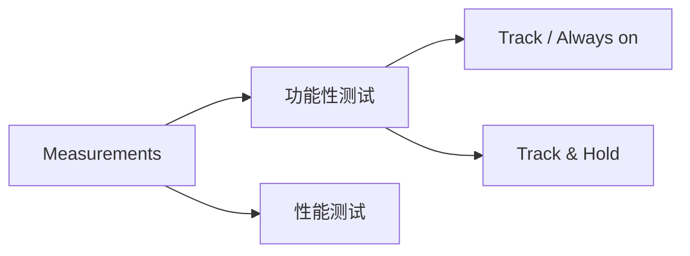

# Alligator Boostrapped Switch Testbench

The repository for testing code and measurement results of Alligator Boostrapped Switch.

---

## Stage1

Tracking Mode，enable信号保持高电位，开关Always On; 
  

## SingleToDifferentialTest

用于测试单端转差分电路电路的性能；