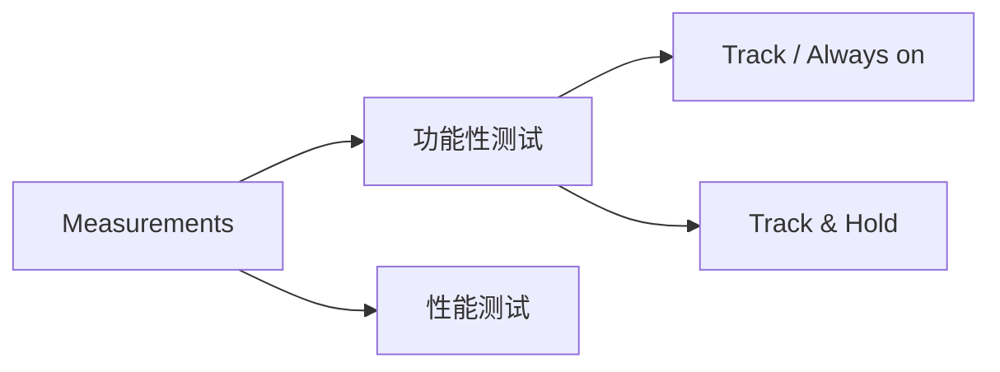

# Alligator Boostrapped Switch Testbench

The repository for testing code and measurement results of Alligator Boostrapped Switch.

---

## Stage1

Tracking Mode，enable信号保持高电位，开关Always On; 
  

## SingleToDifferentialTest

用于测试单端转差分电路电路的性能；

## InstrumentStudio
用于存放关于 NI 示波器的全部测试数据与代码，其中包括 `Instruments Studio` 示例程序与 `matlab` 数据后处理程序；

- **`./PXI-5999`** 存放关于示波器的驱动程序；
- **`./Test_1_Filter_NI`** 测试示波器与1MHz滤波器效果；